<!--suppress HtmlDeprecatedAttribute, HtmlUnknownTarget, HtmlUnknownAnchorTarget -->

  <!-- Banner -->
  <a href="https://nykon.me">
    <picture>
      <source media="(prefers-color-scheme: light)" srcset="./assets/profile/banner_light.svg" />
      
    </picture>
  </a>
  <!-- Bio -->
  

    Building things for people, software and physical products alike. 
    Paying attention to the details that make things feel right.
  

  • • •  

  <!-- Followers Badge -->
  <a href="?tab=followers">
    <picture>
      <source media="(prefers-color-scheme: light)" srcset="https://img.shields.io/github/followers/nykonhrytsyshyn?style=for-the-badge&color=d8dde2&labelColor=606264&logoColor=fff&logo=githubsponsors" />
      
    </picture>
  </a>
  <!-- WakaTime Badge -->
  <a href="https://nykon.me/wakatime">
    <picture>
      <source media="(prefers-color-scheme: light)" srcset="https://wakatime.com/badge/user/da911578-a67d-4dde-9220-e2f9121f2a68.svg?style=for-the-badge&color=d8dde2&labelColor=606264&logoColor=fff" />
      
    </picture>
  </a>
   
  <!-- Stars Badge -->
  <picture>
    <source media="(prefers-color-scheme: light)" srcset="https://img.shields.io/github/stars/nykonhrytsyshyn?style=for-the-badge&color=d8dde2&labelColor=606264&logo=data:image/svg%2bxml;base64,PHN2ZyB4bWxucz0iaHR0cDovL3d3dy53My5vcmcvMjAwMC9zdmciIHZpZXdCb3g9IjAgMCAxNiAxNiI+PHBhdGggZmlsbD0iI2ZmZiIgZD0iTTggLjI1YS43NS43NSAwIDAgMSAuNjczLjQxOGwxLjg4MiAzLjgxNSA0LjIxLjYxMmEuNzUuNzUgMCAwIDEgLjQxNiAxLjI3OWwtMy4wNDYgMi45Ny43MTkgNC4xOTJhLjc1MS43NTEgMCAwIDEtMS4wODguNzkxTDggMTIuMzQ3bC0zLjc2NiAxLjk4YS43NS43NSAwIDAgMS0xLjA4OC0uNzlsLjcyLTQuMTk0TC44MTggNi4zNzRhLjc1Ljc1IDAgMCAxIC40MTYtMS4yOGw0LjIxLS42MTFMNy4zMjcuNjY4QS43NS43NSAwIDAgMSA4IC4yNVptMCAyLjQ0NUw2LjYxNSA1LjVhLjc1Ljc1IDAgMCAxLS41NjQuNDFsLTMuMDk3LjQ1IDIuMjQgMi4xODRhLjc1Ljc1IDAgMCAxIC4yMTYuNjY0bC0uNTI4IDMuMDg0IDIuNzY5LTEuNDU2YS43NS43NSAwIDAgMSAuNjk4IDBsMi43NyAxLjQ1Ni0uNTMtMy4wODRhLjc1Ljc1IDAgMCAxIC4yMTYtLjY2NGwyLjI0LTIuMTgzLTMuMDk2LS40NWEuNzUuNzUgMCAwIDEtLjU2NC0uNDFMOCAyLjY5NFoiLz48L3N2Zz4=" />
    
  </picture>
  <!-- Profile Views Badge -->
  <a href="https://hits.sh/github.com/nykonhrytsyshyn/">
    <picture>
      <source media="(prefers-color-scheme: light)" srcset="https://hits.sh/github.com/nykonhrytsyshyn.svg?style=for-the-badge&label=Views&color=d8dde2&labelColor=606264&logo=github" />
      
    </picture>
  </a>

  <!-- Info Columns -->
  <picture>
    <source media="(prefers-color-scheme: light)" srcset="./assets/profile/info_columns_light.svg" />
    
  </picture>

  <a href="#js-contribution-activity">
    <!-- Total Statistics -->
    <picture>
      <source media="(prefers-color-scheme: light)" srcset="./assets/profile/stats-light.svg" />
      
    </picture>
    <!-- Streak Statistics -->
    <picture>
      <source media="(prefers-color-scheme: light)" srcset="./assets/profile/streak-stats-light.svg" />
      
    </picture>
    <!-- Activity Graph -->
    <picture>
      <source media="(prefers-color-scheme: light)" srcset="./assets/profile/activity-graph-light.svg" />
      
    </picture>
    <!-- Contribution grid -->
    <picture>
      <source media="(prefers-color-scheme: light)" srcset="./assets/profile/contr-grid-snake-light.svg" />
      
    </picture>
  </a>

  <!-- Tech Stack -->
  <picture>
    <source media="(prefers-color-scheme: light)" srcset="./assets/profile/stack_light.svg" />
    
  </picture>

